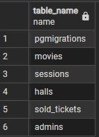
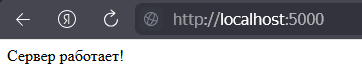
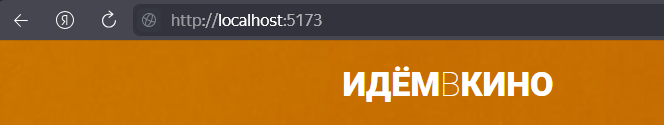

# Frontend: React.js + Typescript + Vite

## Тема: Веб-приложение для бронирования онлайн билетов в кинотеатр и разработка информационной системы для администрирования залов, сеансов и предварительного бронирования билетов.

### Тут ссылка на [Backend](https://github.com/RomanMenshikov92/diploma-backend-express)

### Архитектура веб-приложения - SPA (Single Page Application) + API.

- Фронтенд (Frontend): React.js
- Бэкенд (Backend): Node.js с Express.js
- База данных (Database): PostgreSQL

Сделано так как по моему усмотрению это чистая и хорошо масштабируемая архитектура. Разделение на фронтенд и бэкенд
позволяет независимо разрабатывать и обновлять эти части приложения. Использование Node.js с Express.js для бэкенда
обеспечивает высокую производительность и эффективность, особенно при обработке больших объемов данных в режиме
реального времени. PostgreSQL – надежный выбор для хранения данных.

---

Данные для авторизации администраторов веб-приложения:

- Логин: romanmenshikov@yandex.ru
- Пароль: roman.

---

### Порядок запуска полноценного проекта

1. Запуск базы данных PostgreSQL, версия 17

   - Установка PostgreSQL версии 17
   - создать базу - cinema, а пользователя - cinema
   - дать полные права пользователю для управления базой данных
   - вводим в queryTool на cinema/postgres@PostgreSQL 17 и пишем на предоставление все привилегии на схеме: public - роли (или пользователю) cinema.

   ```
         GRANT ALL PRIVILEGES ON SCHEMA public TO cinema;
   ```

   - далее еще раз вводим в queryTool на cinema/postgres@PostgreSQL 17 и пишем на выборку имен всех таблиц, находящихся в общедоступной схеме: public

   ```
         SELECT table_name
         FROM information_schema.tables
         WHERE table_schema = 'public';
   ```

   

1. Запуск бэкенда

   ```
             "start": "node index.js",
             "dev": "nodemon index.js",
             "migrate": "node runMigrations.js",
             "migrate:up": "node-pg-migrate up",
             "migrate:down": "node-pg-migrate down",
             "reset-db": "node resetDb.js"
   ```

   

2. Запуск фронтенда

   ```
             "dev": "vite",
             "build": "tsc && vite build",
             "lint": "eslint . --ext ts,tsx --report-unused-disable-directives --max-warnings 0",
             "lint:fix": "eslint . --ext ts,tsx --report-unused-disable-directives --max-warnings 0 --fix",
             "preview": "vite preview",
             "format": "prettier --write 'src/**/*.{js,jsx,ts,tsx,json,css,scss,html}
   ```

   

---

<details>
<summary>Описание работы:</summary>

### Дипломный проект по профессии «Веб-разработчик»

Дипломный проект представляет собой создание сайта для бронирования онлайн билетов в кинотеатр и разработка
информационной системы для администрирования залов, сеансов и предварительного бронирования билетов.

### Студенту даются компоненты системы

- [Вёрстка](./sources/layouts.zip).

## Задачи

- Разработать сайт бронирования билетов онлайн.
- Разработать административную часть сайта.

## Сущности

1. **Кинозал**. Помещение, в котором демонстрируются фильмы. Режим работы определяется расписанием на день. Зал —
   прямоугольное помещение, состоит из N х M различных зрительских мест.
2. **Зрительское место**. Место в кинозале. Есть два вида: VIP и обычное.
3. **Фильм**. Информация о фильме заполняется администратором. Фильм связан с сеансом в кинозале.
4. **Сеанс**. Временной промежуток, во время которого в кинозале будет показываться фильм. На сеанс могут быть
   забронированы билеты.
5. **Билет**. QR-код c уникальным кодом бронирования, в котором обязательно указаны место, ряд, сеанс. Билет
   действителен строго на свой сеанс. Для генерации QR-кода можно использовать
   [сервис](http://phpqrcode.sourceforge.net/).

## Роли пользователей системы

- Администратор — авторизованный пользователь.
- Гость — неавторизованный посетитель сайта.

### Возможности администратора

- Создание или редактирование залов.
- Создание или редактирование списка фильмов.
- Настройка цен.
- Создание или редактирование расписания сеансов фильмов.

### Возможности гостя

- Просмотр расписания.
- Просмотр списка фильмов.
- Выбор места в кинозале.
- Бронирование билета на конкретную дату.

## Важные моменты

- Должна присутствовать валидация входных данных на стороне сервера.
- Пароль должен храниться в захешированном виде и при аутентификации должна быть проверка хеша пользователя.

## Этапы разработки

1. Продумайте архитектуру будущего веб-приложения. Выберите вариант реализации: SPA+API, Laravel App или Base PHP. Вы
   можете базироваться на основе фреймворков (Laravel, Yii2), использовать свободные библиотеки для сборки собственного
   приложения либо написать всё самостоятельно.
2. Проанализируйте задание, составьте план. Когда определитесь, что и как хотите делать, вы можете обсудить план с
   дипломным руководителем.
3. Разработайте административную и пользовательскую часть веб-приложения.

### Что в итоге должно получиться

В результате работы должен получиться git-репозиторий, содержащий в себе необходимые файлы проекта и файл ReadMe. В нём
должна быть инструкция, как запустить ваш проект, технические особенности: версия php, процедура миграции базы данных и
другое.

### Частые вопросы

> Что значит кнопка «Открыть продажу билетов»?

По умолчанию зал создаётся неактивным. После нажатия на эту кнопку зал становится доступным гостям. Надпись на кнопке
меянется на «Приостановить продажу билетов».

> Должна ли быть регистрация из административной части сайта?

Регистрация из административной части сайта не является обязательной. Вы можете добавить эту функциональность по своему
усмотрению или можете заносить в базу данных пользователей вручную при помощи миграций.

> Где брать модальные окна?

Файлы с припиской `_popup` — те самые модальные окна в папке «Вёрстка».

## Как задавать вопросы руководителю по дипломной работе

1. Если у вас возник вопрос, попробуйте сначала самостоятельно найти ответ в интернете. Навык поиска информации
   пригодится вам в любой профессиональной деятельности. Если ответ не нашёлся, можно уточнить у руководителя по
   дипломной работе.
2. Если у вас набирается несколько вопросов, присылайте их в виде нумерованного списка. Так дипломному руководителю
   будет проще отвечать на каждый из них.
3. Для лучшего понимания контекста прикрепите к вопросу скриншоты и стрелкой укажите, что именно вызывает вопрос.
   Программу для создания скриншотов можно скачать [по ссылке](https://app.prntscr.com/ru/).
4. По возможности задавайте вопросы в комментариях к коду.
5. Формулируйте свои вопросы чётко, дополняя их деталями. На сообщения «Ничего не работает», «Всё сломалось» дипломный
   руководитель не сможет дать комментарии без дополнительных уточнений. Это затянет процесс получения ответа.
6. Постарайтесь набраться терпения в ожидании ответа на свои вопросы. Дипломные руководители Нетологии – практикующие
   разработчики, поэтому они не всегда могут отвечать моментально. Зато их практика даёт возможность делиться с вами не
   только теорией, но и ценным прикладным опытом.

Рекомендации по работе над дипломом:

1. Не откладывайте надолго начало работы над дипломом. В таком случае у вас останется больше времени на получение
   рекомендаций от руководителя и доработку диплома.
2. Разбейте работу над дипломом на части и выполняйте их поочерёдно. Вы будете успевать учитывать комментарии от
руководителя и не терять мотивацию на полпути.
</details>
